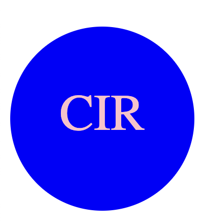
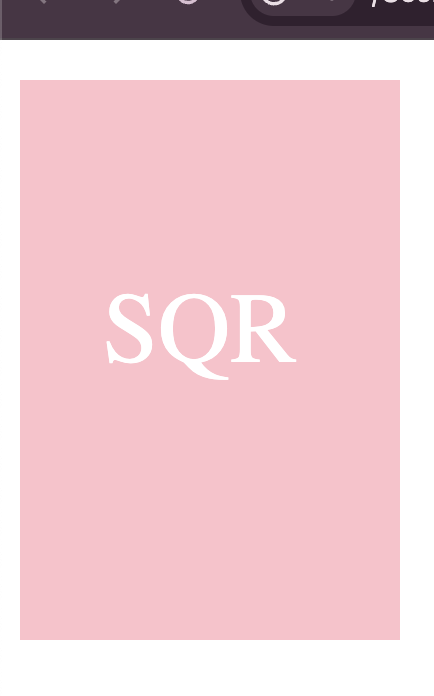
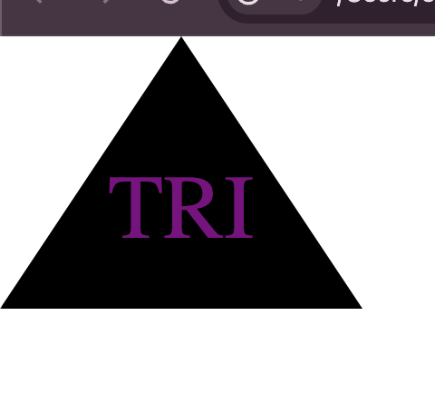

# SVG logo
Challenge 10 implements more JavaScript code, but also includes inquirer and jest.  Jest was used in a test file of code I created to ensure everything was functioning and running without issue. Inquirer was used to help with my command line interface.  This demonstrates my continued knowledge with JavaScript and modules that can be used with it.  It also demonstrates my knowledge with creating content, navigation, and testing through the terminal.  With this I created a logo maker so anyone can pick from three shapes, any color they input, and three characters to create their own custom "logo."

## Technologies & Resources Used
Visual Studio Code
     This is the program used to write all the code for this challenge. Below are the links to the website and their license. https://code.visualstudio.com/ 
     https://code.visualstudio.com/License/

SVG Preview
    This is a visual studio code addon that allows me to preview any svg I create. 
    https://marketplace.visualstudio.com/items?itemName=SimonSiefke.svg-preview
    License: MIT

Github 
    This program was used to upload my code so it is saved and others can view what I have done. Below are the links to the website and license. 
    https://www.github.com
    https://docs.github.com/en/site-policy/github-terms/github-terms-of-service

Xpert Learning Assistant 
    The Xpert Learning Assistant is a chat AI program created by the Full-Stack Web Development program to assist students, like myself, with any questions they may have.

ChatGPT 3.5 
    I used this AI to help further my understanding of back end coding. It helped with clarification from what Xpert Learning Assistant was giving me and I was still was not understanding. 
    https://chat.openai.com/ 
    https://openai.com/policies/terms-of-use

NPM
    NPM This is website offers documentation on different npm packages to enhance my code, more specifically the node_modules folder. https://www.npmjs.com/

Inquirer
    A collection of common interactive command line user interfaces.
    https://www.npmjs.com/package/inquirer
    MIT

Jest
    Jest is a JavaScript testing framework.
    https://jestjs.io/
    https://opensource.fb.com/legal/terms/

## Acknowledgements
JD - Senior Software Developer
    I would like to thank JD helped me figure out why my shapes werent 200px by 300px and why my text was not centering.  He introduced an addon in visual studio code, SVG Viewer, that helped me figure out the exact values I wanted for the genrated logos. He also gave me the code on my index.js file line 96 which created a "timestamp" and with that new code I was able to create a new file for every logo using that const value so they were all unique.

## License
MIT

## Video URL & Screenshots
https://drive.google.com/file/d/1_Uk2iEEiCGu3GzmD4_UeCbdMbQ3zErJ5/view

## Contact Info
https://github.com/Sashuttle